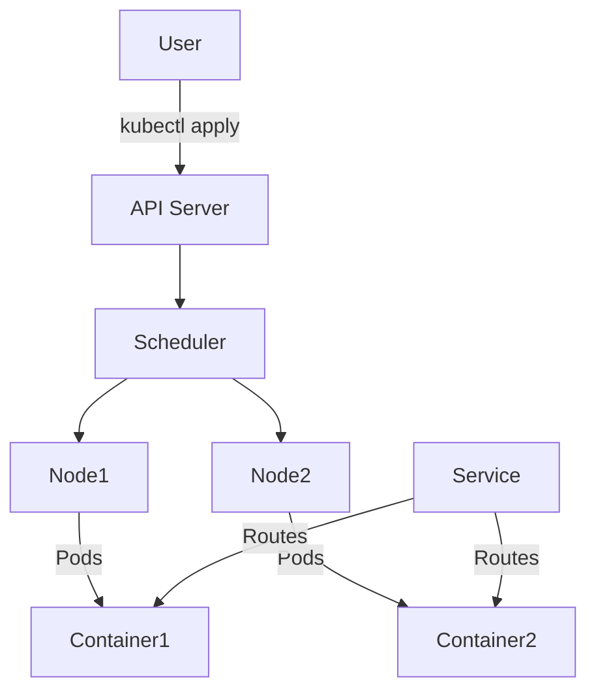
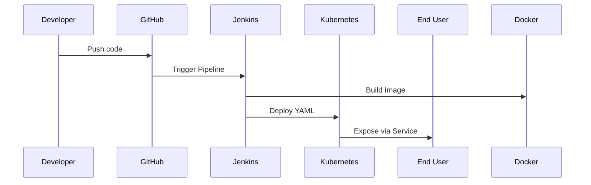
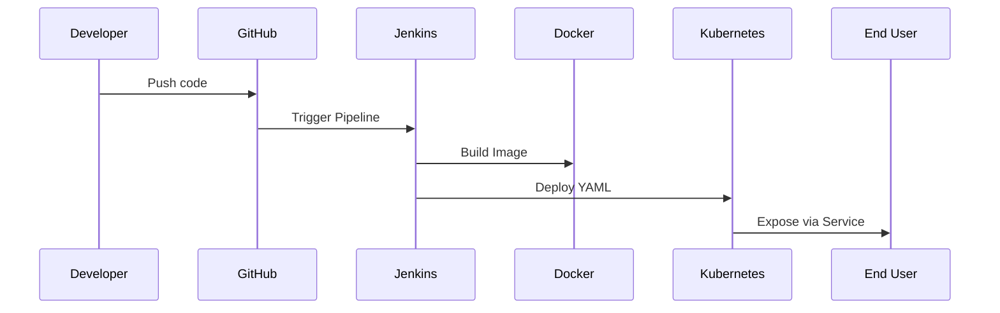

# 🔗 DevOps_Project_02: Kubernetes Integration with Flask + Jenkins + Docker

This guide walks you through extending your CI/CD Flask project by deploying it to **Kubernetes (K8s)** using **Minikube**. You'll learn what Kubernetes is, how it works, and how to automate deployments from Jenkins.

---

## 🔗 What is Kubernetes?

**Kubernetes** is a container orchestration platform that automates deployment, scaling, and management of containerized applications.

### 🔗 Key Benefits

* Self-healing: auto-restarts failed containers
* Load balancing: distributes traffic
* Auto-scaling: adjusts replicas based on load
* Declarative configuration via YAML

---

## 🔗 Core Components of Kubernetes

| Component            | Description                                       |
| -------------------- | ------------------------------------------------- |
| **Pod**              | Smallest unit, contains one or more containers    |
| **Node**             | A VM or physical machine running Kubernetes       |
| **Cluster**          | A group of nodes managed by a control plane       |
| **Deployment**       | Declarative way to define and manage Pods         |
| **Service**          | Exposes Pods to the outside world                 |
| **ConfigMap/Secret** | Injects configuration and sensitive data securely |

---

## 🔗 How Kubernetes Works: Visual Overview



---

## 🔗 Step-by-Step: Add Kubernetes to Your CI/CD Project

### 🔗 Prerequisites

* Docker
* Jenkins
* Flask App
* Installed:

  * `kubectl`
  * `minikube`

---

## 🔗 Project Folder Structure (Updated)

```
flask-cicd-pipeline/
├── app/
│   ├── app.py
│   └── requirements.txt
├── Jenkinsfile
├── Dockerfile
├── k8s/
│   ├── deployment.yaml
│   └── service.yaml
├── README.md
└── .gitignore
```

---

## 🔗 Kubernetes Manifests

### `k8s/deployment.yaml`

```yaml
apiVersion: apps/v1
kind: Deployment
metadata:
  name: flask-app-deployment
spec:
  replicas: 2
  selector:
    matchLabels:
      app: flask-app
  template:
    metadata:
      labels:
        app: flask-app
    spec:
      containers:
      - name: flask-app
        image: flask-cicd-app
        ports:
        - containerPort: 5000
```

### `k8s/service.yaml`

```yaml
apiVersion: v1
kind: Service
metadata:
  name: flask-service
spec:
  type: NodePort
  selector:
    app: flask-app
  ports:
    - protocol: TCP
      port: 80
      targetPort: 5000
      nodePort: 30036
```

---

## 🔗 Run Minikube & Build Docker Image

```bash
# Start minikube
minikube start --driver=docker

# Point terminal to minikube's Docker
eval $(minikube docker-env)

# Build Docker image
docker build -t flask-cicd-app .
```

---

## 🔗 Deploy Flask App to Kubernetes

```bash
kubectl apply -f k8s/deployment.yaml
kubectl apply -f k8s/service.yaml
```

```bash
# Check deployments
kubectl get deployments
kubectl get pods
kubectl get svc

# Access the app
minikube service flask-service
```

---

## 🔗 Update Jenkins Pipeline for Kubernetes

### 🔗 Add Stage to `Jenkinsfile`

```groovy
stage('Deploy to Kubernetes') {
  steps {
    script {
      sh 'kubectl apply -f k8s/deployment.yaml'
      sh 'kubectl apply -f k8s/service.yaml'
    }
  }
}
```

> Jenkins must have `kubectl` access.

---

## 🔗 Visual Workflow Overview



---

# 🔗 Visual Workflow Interpretation

This section provides a breakdown of the visual workflow represented in the Mermaid diagram from the project. Each interaction between components is explained to clarify how the CI/CD pipeline works in practice.

---

## 🔗 Mermaid Diagram



---

## 🔍 Step-by-Step Interpretation

### 1. `Dev ->> Git: Push code`

* **What it means:** The developer writes code (e.g., Flask app) and pushes it to a GitHub repository.
* **Why it's important:** This push acts as the trigger for the entire CI/CD pipeline.

---

### 2. `Git ->> Jenkins: Trigger Pipeline`

* **What it means:** GitHub notifies Jenkins (via webhook or polling) that new code has been pushed.
* **Why it's important:** Jenkins needs to know when to start the CI/CD process based on code changes.

---

### 3. `Jenkins ->> Docker: Build Image`

* **What it means:** Jenkins executes a pipeline stage that runs `docker build` to create a Docker image of the Flask app.
* **Why it's important:** Containerizing the app ensures consistent environments for testing and deployment.

---

### 4. `Jenkins ->> K8s: Deploy YAML`

* **What it means:** Jenkins applies Kubernetes manifests (`deployment.yaml`, `service.yaml`) using `kubectl apply`.
* **Why it's important:** This step deploys the containerized app into the Kubernetes cluster.

---

### 5. `K8s ->> User: Expose via Service`

* **What it means:** Kubernetes exposes the deployed app to users via a `Service`, such as NodePort or LoadBalancer.
* **Why it's important:** This allows users to access the app through a browser or API endpoint.

---

## ✅ Summary Table

| Actor      | Role                                |
| ---------- | ----------------------------------- |
| Developer  | Writes and pushes code              |
| GitHub     | Triggers Jenkins when code changes  |
| Jenkins    | Automates CI/CD tasks               |
| Docker     | Containerizes the app               |
| Kubernetes | Orchestrates and runs the container |
| User       | Accesses the live application       |

---

> This interpretation helps reinforce the understanding of each component’s role in a modern DevOps CI/CD pipeline.


## 🔗 What’s Next?

* Add Helm charts for reusability
* Configure readiness/liveness probes
* Deploy to AWS/GCP

---

## 🔗 Questions or Feedback?

This project is part of my DevOps learning journey. Fork it, build on it, and feel free to reach out with suggestions!

> Built with motivation by Rubaiya
