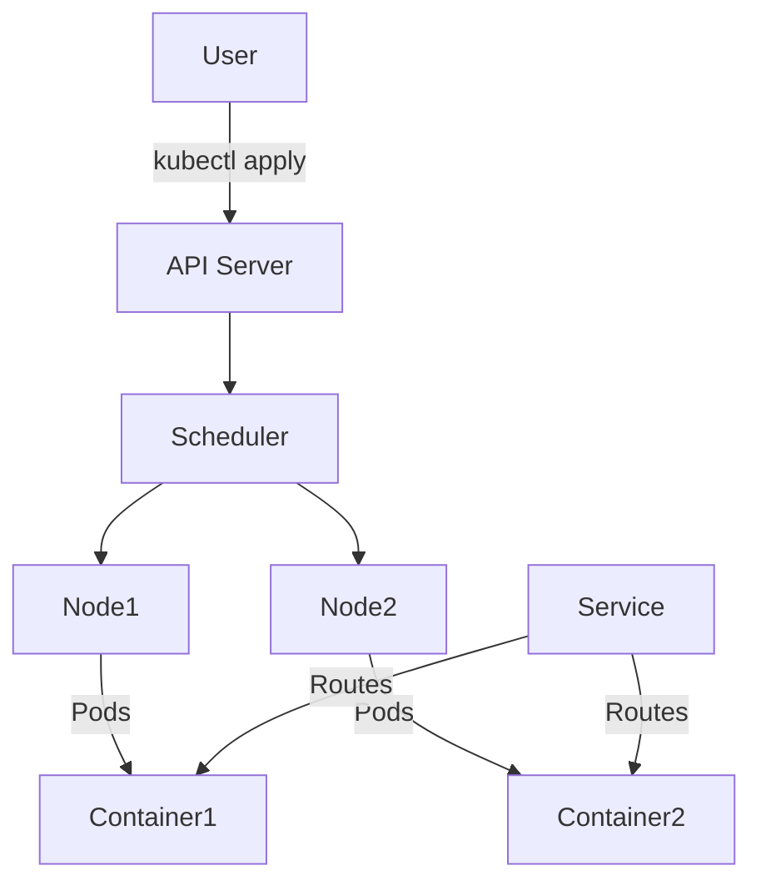
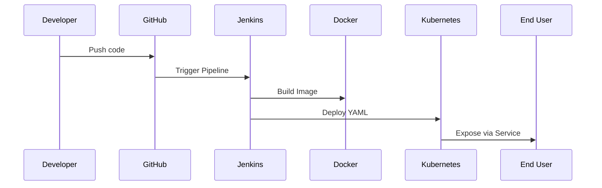

# 🔗 DevOps_Project_02: Kubernetes Integration with Flask + Jenkins + Docker

This guide walks you through extending your CI/CD Flask project by deploying it to **Kubernetes (K8s)** using **Minikube**. You'll learn what Kubernetes is, how it works, and how to automate deployments from Jenkins.

---

## 🔗 What is Kubernetes?

**Kubernetes** is a container orchestration platform that automates deployment, scaling, and management of containerized applications.

### 🔗 Key Benefits

* Self-healing: auto-restarts failed containers
* Load balancing: distributes traffic
* Auto-scaling: adjusts replicas based on load
* Declarative configuration via YAML

---

## ***Are you confused now?***
Don't worry!!! I went through that phase also.

Let's read this story to make every connections clear!

Imagine a tiny bakery run by a very busy baker named Jenny (that’s **Jenkins**!). She gets orders from her customers (developers) through a message board called **GitHub**. Whenever a customer posts a new cake recipe on the board (pushes code), Jenny rushes to the kitchen to get baking.

But Jenny isn’t baking the cakes by hand anymore. She has a smart machine named **Docker**. Docker is like a magical oven that bakes cakes exactly the same way every time, no matter which kitchen it’s in. Jenny just hands Docker the recipe (code) and instructions (Dockerfile), and Docker creates a perfectly shaped cake (a container) every single time.

Now, here’s the problem: Jenny’s bakery gets *a lot* of cake orders. She can’t serve everyone by herself. That’s where her robot friends come in. Meet Kube, the leader of a team of robot bakers called Kubernetes.

Jenny (Jenkins) gives the finished cake (Docker container) to Kube. She also gives Kube a piece of paper with clear instructions: "Make 3 copies of this cake, keep them fresh, and if any go bad, replace them!" This paper is called a deployment.yaml.

Kube reads the instructions and sends the cakes to his robots (Pods) who live in different mini-bakeries (Nodes). These robots serve the cakes to hungry customers through a service window (called a Service).

And guess what? If one of the robots drops a cake, Kubernetes quickly bakes a new one without asking Jenny!

So in short:

* **Jenny (Jenkins)** = Task manager who listens for cake orders (code updates) and runs the kitchen.
* **Docker** = Magic oven that builds cakes (containers) from recipes (code).
* **Kube (Kubernetes)** = Cake distribution system that makes sure all customers get cakes, replaces bad ones, and scales if orders increase.

All Jenny has to do is:

1. Watch the board (GitHub) for new recipes.
2. Ask Docker to build a cake.
3. Hand the cake and instructions to Kube.

And the entire cake bakery runs itself!

That’s CI/CD with Jenkins, Docker, and Kubernetes—deliciously automated. 🍰


## 🔗 Core Components of Kubernetes

| Component            | Description                                       |
| -------------------- | ------------------------------------------------- |
| **Pod**              | Smallest unit, contains one or more containers    |
| **Node**             | A VM or physical machine running Kubernetes       |
| **Cluster**          | A group of nodes managed by a control plane       |
| **Deployment**       | Declarative way to define and manage Pods         |
| **Service**          | Exposes Pods to the outside world                 |
| **ConfigMap/Secret** | Injects configuration and sensitive data securely |

---

## 🔗 How Kubernetes Works: Visual Overview



### 🔗 Interpreting the Kubernetes Block Diagram with a Story

Let's imagine Kubernetes as a smart restaurant kitchen where users can place orders and the system knows exactly how to cook, assign chefs, and serve dishes on time without a manager shouting instructions.

Here’s the diagram again for context:


Now, let’s interpret each step as a story:

---

### 🔹 1. User → API Server (`kubectl apply`)

**Story:** Think of the user as a customer placing a food order.

**What happens:** The customer sends a request saying, "I want two burgers and one pizza." This is done using the command `kubectl apply`, which sends the YAML recipe (deployment file) to the kitchen manager — the API Server.

**Why it matters:** This is how the system knows what needs to be cooked (deployed).

---

### 🔹 2. API Server → Scheduler

**Story:** The API Server is like the kitchen receptionist. She takes your order and passes it to the Chef Scheduler, who decides which chef (Node) should prepare your meal.

**What happens:** The Scheduler receives the task and checks who’s free and has the right ingredients/tools to cook.

**Why it matters:** It ensures that the workload is balanced and nobody is overwhelmed.

---

### 🔹 3. Scheduler → Node1 and Node2

**Story:** The Scheduler assigns different parts of the order to available chefs in different stations (Node1 and Node2).

**What happens:** One Node might be cooking your burger, and the other is baking your pizza.

**Why it matters:** Distributes the work across machines for speed and reliability.

---

### 🔹 Node1 and Node2 → Pods → Containers

**Story:** Each chef (Node) runs cooking stations (Pods) where the actual dishes (Containers) are made.

**What happens:** Inside these Pods, Docker Containers run your actual application (like the Flask web app), just like a chef follows a specific recipe.

**Why it matters:** Containers are isolated environments, so no matter where the dish is cooked, it tastes the same.

---

### 🔹 Service → Routes to Container1 & Container2

**Story:** Once the food is ready, the waiter (Service) brings it to your table, whether it was cooked in Station 1 or Station 2.

**What happens:** Kubernetes sets up a Service that acts like a smart waiter. It knows where the food is and delivers it to the right customer, regardless of which kitchen made it.

**Why it matters:** This allows users to access the app without knowing which Pod (chef) actually cooked it.

---

### Final Analogy Summary

* **User:** Customer placing an order
* **kubectl apply:** Submitting the recipe
* **API Server:** Receptionist
* **Scheduler:** Kitchen Manager
* **Node:** Cooking Station
* **Pod:** Cooking Spot on the Station
* **Container:** Actual dish being cooked
* **Service:** Waiter delivering your dish to your table

This is how Kubernetes makes sure your app (like your burger or pizza) is prepared and served correctly every time.

Let me know if you'd like this illustrated with icons or images!


---

## 🔗 Step-by-Step: Add Kubernetes to Your CI/CD Project

### 🔗 Prerequisites

* Docker
* Jenkins
* Flask App
* Installed:

  * `kubectl`
  * `minikube`

---

## 🔗 Project Folder Structure (Updated)

```
flask-cicd-pipeline/
├── app/
│   ├── app.py
│   └── requirements.txt
├── Jenkinsfile
├── Dockerfile
├── k8s/
│   ├── deployment.yaml
│   └── service.yaml
├── README.md
└── .gitignore
```

---

## 🔗 Kubernetes Manifests

### `k8s/deployment.yaml`

```yaml
apiVersion: apps/v1
kind: Deployment
metadata:
  name: flask-app-deployment
spec:
  replicas: 1
  selector:
    matchLabels:
      app: flask-app
  template:
    metadata:
      labels:
        app: flask-app
    spec:
      containers:
      - name: flask-container
        image: flask-cicd-app:latest
        ports:
        - containerPort: 5000
        readinessProbe:
          httpGet:
            path: /
            port: 5000
          initialDelaySeconds: 5
          periodSeconds: 10
        livenessProbe:
          httpGet:
            path: /
            port: 5000
          initialDelaySeconds: 15
          periodSeconds: 20
```

### `k8s/service.yaml`

```yaml
apiVersion: v1
kind: Service
metadata:
  name: flask-service
spec:
  type: NodePort
  selector:
    app: flask-app
  ports:
    - protocol: TCP
      port: 80
      targetPort: 5000
      nodePort: 30007
```

---

## 🔗 Run Minikube & Build Docker Image

```bash
# Start minikube
minikube start --driver=docker

# Point terminal to minikube's Docker
eval $(minikube docker-env)

# Build Docker image
docker build -t flask-cicd-app .
```

---

## 🔗 Deploy Flask App to Kubernetes

```bash
kubectl apply -f k8s/deployment.yaml
kubectl apply -f k8s/service.yaml
```

```bash
# Check deployments
kubectl get deployments
kubectl get pods
kubectl get svc

# Access the app
minikube service flask-service
```

---

## 🔗 Update Jenkins Pipeline for Kubernetes

### 🔗 Add Stage to `Jenkinsfile`

```groovy
stage('Deploy to Kubernetes') {
  steps {
    script {
      sh 'kubectl apply -f k8s/deployment.yaml'
      sh 'kubectl apply -f k8s/service.yaml'
    }
  }
}
```

> Jenkins must have `kubectl` access.

---

## 🔗 Visual Workflow Interpretation

This section provides a breakdown of the visual workflow represented in the Mermaid diagram from the project. Each interaction between components is explained to clarify how the CI/CD pipeline works in practice.

---

## 🔗 Mermaid Diagram


---

## 🔗 Step-by-Step Interpretation

### 1. `Dev ->> Git: Push code`

* **What it means:** The developer writes or updates the application code (for example, a Flask app) and pushes it to a GitHub repository.
* This step uploads the latest code to GitHub, which is the version control system.
* **Why it's important:** This is the starting point of the automation process. Pushing code tells the system it's time to start the pipeline.

### 2. `Git ->> Jenkins: Trigger Pipeline`

* **What it means:** GitHub lets Jenkins know that new code has been pushed. This is usually done through a webhook or Jenkins checking GitHub regularly.
* This is how Jenkins knows it should begin running the automated steps.
* **Why it's important:** It helps make sure every code change is automatically tested, built, and deployed without the developer needing to do anything extra.

### 3. `Jenkins ->> Docker: Build Image`

* **What it means:** Jenkins runs a step in its pipeline to create a Docker image from the updated code.
* In simple terms, Jenkins tells Docker to take the code and package it into a container image using the `docker build` command.
* or i cansay, Jenkins is calling/triggering Docker. Jenkins (via its pipeline) is instructing Docker to build an image using the docker build command.
* Jenkins is the CI/CD orchestrator that runs scripted steps. Docker is the tool being used by Jenkins.
* So, Jenkins is in charge of the automation and Docker is the tool that does the building.
* **Why it's important:** Creating a Docker image helps your app run the same way no matter where it's deployed, which makes testing and deployment more reliable.

### 4. `Jenkins ->> K8s: Deploy YAML`

* **What it means:** Jenkins uses Kubernetes configuration files (YAML files) to deploy the Docker image.
* It runs commands like `kubectl apply -f deployment.yaml` to send the app to the Kubernetes cluster.
* **Why it's important:** This step makes sure the new version of the app is deployed automatically without any manual steps.

### 5. `K8s ->> User: Expose via Service`

* **What it means:** Kubernetes sets up a Service that makes the app accessible to users through the internet or a local network.
* It routes the request from the user's browser to the app running inside a container.
* **Why it's important:** Without this, users wouldn't be able to open the app in a browser or connect to it.

---

## Summary Table

| Actor      | Role                                |
| ---------- | ----------------------------------- |
| Developer  | Writes and pushes code              |
| GitHub     | Triggers Jenkins when code changes  |
| Jenkins    | Automates CI/CD tasks               |
| Docker     | Containerizes the app               |
| Kubernetes | Orchestrates and runs the container |
| User       | Accesses the live application       |

---

> This interpretation helps reinforce the understanding of each component’s role in a modern DevOps CI/CD pipeline.

---

### What to Do Every Time You Reboot Ubuntu

```bash
sudo systemctl start docker  # Ensure Docker is running

docker start jenkins         # Start your custom Jenkins container
```

To verify Jenkins:

```bash
docker ps  # Look for "jenkins" container running
```

Then open Jenkins in the browser:

```text
http://localhost:8080
```

---

### Step-by-Step: Integrating Kubernetes (Minikube or Kind)

If you don’t have Kubernetes installed yet, choose one of these lightweight options:

#### Option A: Install Minikube

```bash
curl -LO https://storage.googleapis.com/minikube/releases/latest/minikube-linux-amd64
sudo install minikube-linux-amd64 /usr/local/bin/minikube
minikube start --driver=docker
```

#### Option B: Install Kind (Kubernetes IN Docker)

```bash
curl -Lo ./kind https://kind.sigs.k8s.io/dl/latest/kind-linux-amd64
chmod +x ./kind
sudo mv ./kind /usr/local/bin/kind
```

Create a cluster:

```bash
kind create cluster
```

---

### Connect Jenkins to Kubernetes

#### Option 1: Run `kubectl` from Jenkins container

1. Install `kubectl` on your host:

   ```bash
   sudo apt install -y kubectl
   ```

2. Mount your Kube config into Jenkins container:

   ```bash
   docker run -d \
     --name jenkins \
     -p 8080:8080 -p 50000:50000 \
     -v jenkins_home:/var/jenkins_home \
     -v /var/run/docker.sock:/var/run/docker.sock \
     -v $HOME/.kube:/root/.kube \
     my-jenkins-docker
   ```

3. Add a pipeline stage in Jenkinsfile:

   ```groovy
   stage('Deploy to Kubernetes') {
     steps {
       script {
         sh 'kubectl apply -f deployment.yaml'
       }
     }
   }
   ```

#### Option 2: Use Kubernetes Jenkins Plugin (Advanced)

* Install the Kubernetes plugin in Jenkins UI
* Configure cloud credentials for K8s access
* Use a `kubernetes` agent in Jenkinsfile

---

### Example: Full Jenkinsfile with Kubernetes Deploy Stage

```groovy
pipeline {
  agent any

  environment {
    IMAGE_NAME = "flask-cicd-app"
    CONTAINER_NAME = "flask_app"
  }

  stages {
    stage('Build Docker Image') {
      steps {
        script {
          sh 'docker build -t $IMAGE_NAME .'
        }
      }
    }

    stage('Stop Existing Container') {
      steps {
        script {
          sh "docker ps -q --filter name=$CONTAINER_NAME | grep -q . && docker rm -f $CONTAINER_NAME || true"
        }
      }
    }

    stage('Run Docker Container') {
      steps {
        script {
          sh "docker run -d -p 5000:5000 --name $CONTAINER_NAME $IMAGE_NAME"
        }
      }
    }

    stage('Deploy to Kubernetes') {
      steps {
        script {
          sh 'kubectl apply -f deployment.yaml'
        }
      }
    }
  }
}
```

---

### Final Checkpoints

* [x] Docker daemon is running
* [x] Jenkins container is started using custom image
* [x] K8s (Minikube or Kind) is up and running
* [x] Jenkins has access to `kubectl`
* [x] Jenkinsfile includes Kubernetes deploy stage

---

## Final Step: Kubernetes Deployment & Rollback Support (Minikube) (Optional) 

Here’s everything you need to complete your CI/CD pipeline with **Kubernetes deployment**, **Service exposure** and **optional rollback scripting**.

---

Check app access:

```bash
minikube service flask-service --url
```

---

### 3. Optional: Add Health Check + Rollback Logic

Extend `deployment.yaml` with health checks:

```yaml
        readinessProbe:
          httpGet:
            path: /
            port: 5000
          initialDelaySeconds: 5
          periodSeconds: 10
        livenessProbe:
          httpGet:
            path: /
            port: 5000
          initialDelaySeconds: 15
          periodSeconds: 20
```

Add a rollback script in Jenkinsfile:

```groovy
stage('Health Check and Rollback') {
  steps {
    script {
      def status = sh(script: "kubectl get pods | grep flask-app | grep Running | wc -l", returnStdout: true).trim()
      if (status != '1') {
        echo 'Deployment failed. Rolling back...'
        sh 'kubectl rollout undo deployment/flask-app-deployment'
      } else {
        echo 'Deployment healthy.'
      }
    }
  }
}
```

---

## 🔗 What’s Next?

* Add Helm charts for reusability
* Configure readiness/liveness probes
* Deploy to AWS/GCP

---

## 🔗 Questions or Feedback?

This project is part of my DevOps learning journey. Fork it, build on it, and feel free to reach out with suggestions!

> Built with motivation by Rubaiya
